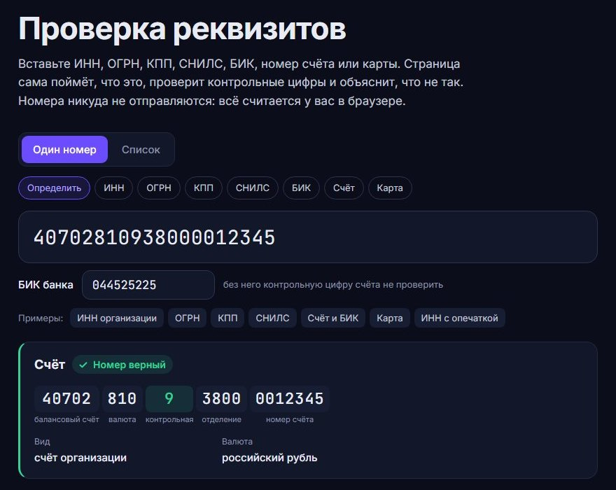
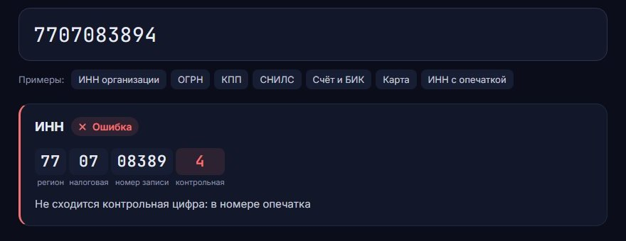

# Реквизиты

Проверка российских реквизитов для Go и TypeScript: ИНН, ОГРН и ОГРНИП, КПП, СНИЛС, БИК, расчётный и корреспондентский счёт, номер карты.

Кроме ответа «верно» или «неверно» библиотека объясняет по-русски, что не так, и показывает, что видно из самого номера: регион по ИНН, год записи по ОГРН, вид и валюту счёта, платёжную систему карты.

**Демо: [fedorov-n.ru/rekvizity](https://fedorov-n.ru/rekvizity/)**. Вставьте номер, страница сама поймёт, что это. Номера никуда не отправляются, всё считается в браузере.



## Зачем

В формах реквизиты часто проверяют регулярным выражением вроде `^\d{10}$`. Оно пропускает опечатку в одной цифре, и ошибка всплывает позже: банк возвращает платёжку, в договоре оказывается чужой ИНН. У большинства реквизитов есть контрольные цифры, и по ним опечатку видно сразу, пока человек ещё не ушёл из формы.



## Go

```
go get github.com/Ozziess01/rekvizity
```

```go
r := rekvizity.INN("7707083894")
r.Valid   // false
r.Code    // "checksum"
r.Message // "не сходится контрольная цифра: в номере опечатка"

r = rekvizity.Account("40702810938000012345", "044525225")
r.Fact("Вид")    // "счёт организации"
r.Fact("Валюта") // "российский рубль"

// Вид номера угадывается по длине и формату.
for _, r := range rekvizity.Detect("112-233-445 95") {
	fmt.Println(r.Kind, r.Valid) // snils true
}
```

Пробелы, дефисы и точки в номере можно не убирать: «4111 1111 1111 1111» и «112-233-445 95» проверяются как есть. Зависимостей нет.

## TypeScript

```ts
import { inn, account, detect } from "./rekvizity";

inn("7707083893").facts;
// [{ label: "Тип", value: "организация" }, { label: "Регион", value: "Москва" }, …]

account("40702810938000012345", "044525974").message;
// "не сходится контрольная цифра: опечатка в счёте или счёт из другого банка"
```

В npm пакет пока не опубликован. Код лежит в [js/src](js/src): два файла без зависимостей, их можно скопировать к себе. Работает в браузере и в Node.

## Что проверяется

| Реквизит | Длина | Проверка | Что видно из номера |
|---|---|---|---|
| ИНН | 10 или 12 | контрольные цифры: взвешенная сумма по модулю 11 | организация или человек, регион |
| ОГРН, ОГРНИП | 13 или 15 | остаток от деления на 11 (у ИП на 13) | организация или ИП, год записи, регион |
| КПП | 9 | формат: на 5–6 месте бывают латинские буквы | регион, причина постановки на учёт |
| СНИЛС | 11 | контрольное число | |
| БИК | 9 | формат, у российских банков начинается с 04 | код территории, номер банка |
| Счёт | 20 | контрольная цифра, считается вместе с БИК | вид счёта, валюта |
| Карта | 13–19 | алгоритм Луна | платёжная система |

Ошибка приходит с кодом (`empty`, `chars`, `length`, `format`, `checksum`, `bik_required`, `bik`), чтобы программа могла на него реагировать, и с текстом, который можно показать человеку как есть.

Счёт без БИК проверить нельзя: контрольная цифра считается по последним цифрам БИК. Поэтому счёт, переписанный из реквизитов одного банка с БИК другого, тоже не пройдёт проверку.

## Чего по номеру не узнать

Верная контрольная цифра значит одно: в номере нет опечатки. Существует ли такая организация, открыт ли счёт, действует ли карта, по номеру не понять. Это проверяют сервисы ФНС и банки, а библиотека отсекает опечатки до обращения к ним.

## Как проверено

- Обе реализации проходят общий набор примеров [testdata/cases.json](testdata/cases.json): 47 номеров, среди них настоящие реквизиты крупных компаний и банков и их испорченные копии. Если Go и TypeScript начнут отвечать по-разному, упадут тесты.
- Go-версию гоняет фаззер: на случайной строке `Detect` не должен падать или возвращать ошибку без объяснения.
- Отдельный тест перебирает все одиночные опечатки в ИНН организации. Алгоритм пропускает только те, где остаток от деления равен 10: он записывается как 0 и совпадает с другим остатком.

```
go test ./...
cd js && npm ci && npm test
cd web && npm ci && npm run dev   # демо-страница
```

## Лицензия

MIT
